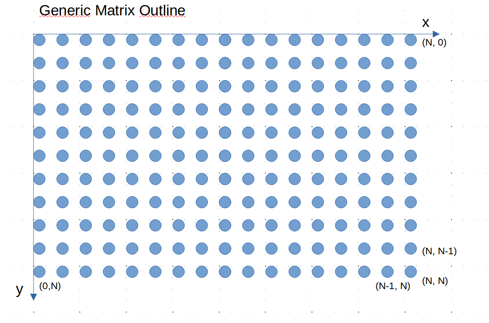
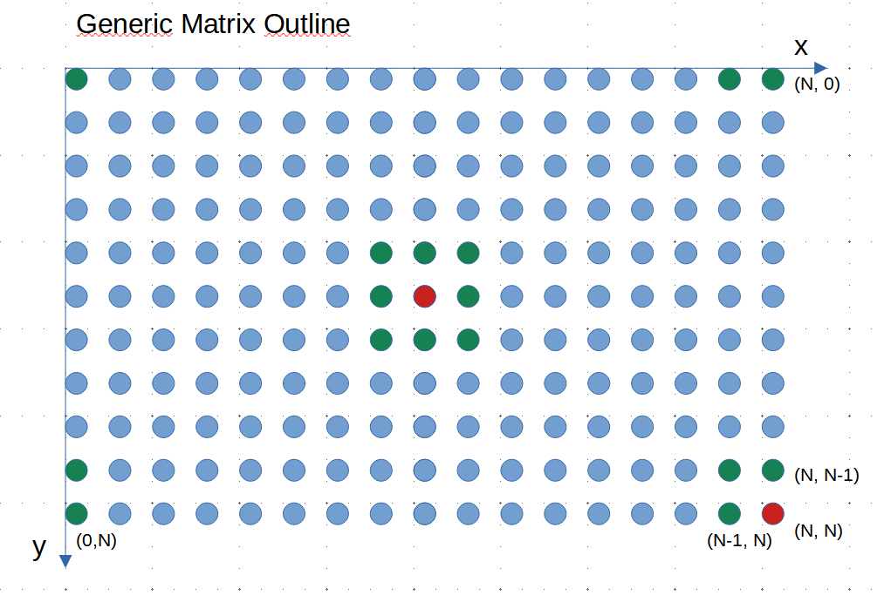
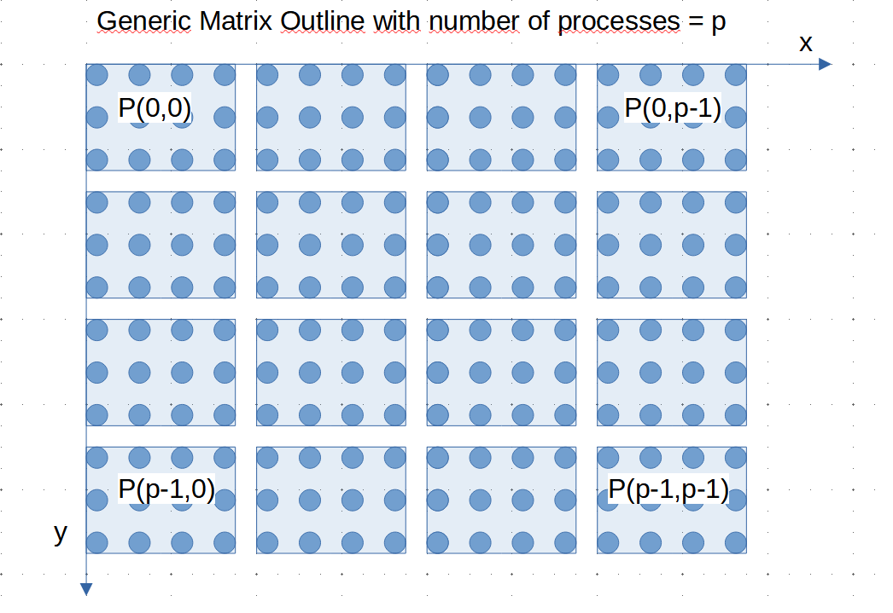

# HPC Assignment 1: Game of Life Stencil
**2023 TU WIEN, Group Project by Group 16**

In the following, we discuss general ideas on how to implement the project, e.g. which datatypes we use and which classes we define.

## 1. Task description

We are implementing a two dimensional stencil computation on small integers, and for that purpose we choose *Game of Life*.
In the *Game of Life* a so-called **cell** can be either dead or alive. The cells are then distributed in a N x N matrix, which is 
illustrated in the following picture:

In the first generation, each cell is either dead or alive with a certain probability (input parameter in our program). In the *Game of Life* 
cells either live or die depending on the state of their neighbours. The following principles must be implemented in our case:

    - each cell has 8 neighbours
    - alive cell survives to next generation if:
        - 2 or 3 neigbours are alive
    - dead cell gets reborn to next generation if:
        - exactly 3 neighbours are alive
    - if not reborn or survive:
        - dead for next generation

These are the core principles to consider. Another important aspect of the task is, that the matrix is folded, so if we access an entry at a 
out-of-bounce position in an N x N matix:

    Matrix[N+1, 0] = Matrix[0,0]
    Matrix[0, N+1] = Matrix[0,0]
    Matrix[N+1, N+1] = Matrix[0,0]
    Matrix[N+1, 1] = Matrix[0, 1]
    (...... and so on)

The neighbour situation corresponding to these constraints, is illustrated below:

So the goal is to calculate the state of the new generation, meaning calculating each state of each cell, a lot of times. In the task they say we should aim for at least
1000 generations. After that we should report the final state.

### 1.1 MPI and processes

So how does MPI come into play here? We use independent sub-sections of the matrix and assign it to processes, which are by themselves "packed" into a grid:

The calculations for these processes are only partly independent, because on the edges we need communication. However, if the block size for one process becomes big, we
can expect a almost linear speed up according to Prof. Träff.

## 2. Task implementation

### 2.1 Design ideas

There are two main considerations apart from the algorithms:

    - data structure for matrix
    - data type for cell state

We note the task description: "The cell contents should be represented by a short C data type, either char or a bit in a word. Your implementation must be space efficient
in the sense of maintaining at most two generations, the current and the next, that is at most two n×n matrices."

**Data Structure for Matrix**:

Given we are programming in C++, some possibilities from the std library inlcude:

    - vector
    - array
    - list
    (...)

Vector is very often the correct choice because its feature rich, dynamic and provides data locality. Lets look at the advantages of array and list over a vector, and 
see if these advantages are important to us:

    - Vector vs. List: A list might be the better choice if our vector grows dynamically and the copying of that memory is expensive (list elements always stay at the same
                        memory location, vector elements don´t). Also list is better if we insert very often in the middle of the data struct. 
                        --> both advantages not relevant in our case

    - Vector vs. Array: An array might be the better choice if we want to allocate on the stack. 
                        --> not the case, our matrix size might lead to stack-overflow

Therefore *std::vector* is a good choice.

**Data Type for Cell State**:

Some possibilities include:

    - char: 8 Bit
    - short int (unsigned): 16 Bit
    - a single bit in a machine word, e.g. uint_64: 1 Bit

The advantage of the first two is obviously simplicity. However, the advantage of the last one is space efficiency for sure. 

*Char* for the beginning is a good choice, but bitwise operations on a machine word seem like a interesting (but more complicated) alternative.

**Do we need classes?**

Probably not, but they are convenient for the Cell. Look at this example:

class Cell
{
private:
    char state;
    
public:
    Cell(char s) : state(s) {}
    
    void setStateToDead() {
        this->state = 'd';
    }
    void setStateToAlive() {
        this->state = 'a';
    }
};

The member functions like getter, setter make things a little easier and safer. The alternative is to fill up the std::vector with chars and assign it directly. 
Also okay I guess... Memory concerns: Does the cell need more memory? No! member functions are not stored in the object but the class definition. Both are 1 byte!

Same goes for a MatrixType and Generation consisting of a Matrix.

**Compiling**

As stated in [1], chapter 3.2.4, an MPI program can be compiled with a normal C/C++ compiler and a wrapper mpicc/mpicxx. We use mpicxx (mpic++ is the same thing).

### 2.2 Classes and functions

#### Cell (Class)

**members:** char
**member-functions:** setAlive(), setDead(), checkIfAlive() ....

#### Matrix (Class)

**members:** std::vector<std::vector<Cell>>
**member-functions:** getMatrix(), Parameter Constructor with probability of alive cells etc., default constructor...

#### Generation (Class)

**members:** Matrix
**member-functions:** printGeneration(), getGeneration(), countAliveNeighbours() ....

#### calculateNextGenSequentially (Function)

**input:** Generation object (reference)
**output:** Generation object
**algorithm:** Two for-loops which iterate over the matrix and count for each cell the alive neighbours of the 8 neighbours. Based on the conditions of the game of life
            the cell lives or dies. The only slightly tricky part is to "fold" the matrix, so making sure the upper_row, lower_row, left_col, right_col values are correct.

#### calculateNextGenParallel (Function)

**input:** Generation object (reference), num_of_processes
**output:** Generation object
**algorithm:** Basics are similar to sequential version. We retrieve a sub-Matrix (getSubMatrix()) from the generation, in which the rows and columns are based on the process number. This matrix is then calculated by the respective process with MPI communication (more details are provided in the following chapters) and at the end, the new Generation is returned.

#### areGenerationsEqual (Function)

#### getSubMatrix (Function)

### 2.3 Exercise 1

*The entry point for the first, sequential MPI implementation can be found in src/sequential/main.cpp*

**Step 1:** We pass 3 command line arguments to the program: <matrix_dim_N> <prob_of_life> <number_of_repetitions>
**Step 2:** We initialize the first Generation based on the input parameters (dim N and probability of Life)

------------------------------------------------------------------------------------------
    Generation current_gen{Matrix(N, prob_of_life)};
------------------------------------------------------------------------------------------

**Step 3:** We initialize MPI. For that we follow the script [1], page 134 - 136.

------------------------------------------------------------------------------------------
    MPI_Init(&argc, &argv);

    int rank, size;
    MPI_Comm_rank(MPI_COMM_WORLD, &rank);
    MPI_Comm_size(MPI_COMM_WORLD,&size);
------------------------------------------------------------------------------------------

**Step 4:** We calculate the next Generation with our sequential function calculateNextGenSequentially() and measure the time with MPI_Wtime

------------------------------------------------------------------------------------------
    for (int i = 0; i < number_of_repetitions; i++)
    {
        start_time = MPI_Wtime();

        next_gen = calculateNextGenSequentially(current_gen);

        end_time = MPI_Wtime();
        times.push_back(end_time - start_time);

        current_gen = next_gen;
    }
------------------------------------------------------------------------------------------

We calculate it a certain number of repetitions, which is an input to our program as well. The code is only executed by one single process (rank == 0).
The times taken by MPI_WTime() are averaged later, and we store it in a std::vector.

**Step 5:** We finalize MPI and Post Process the data --> output a summary of dead and alive cells, average time of calculation

------------------------------------------------------------------------------------------
    int alive_cells{0};
    int dead_cells{0};
    countAliveAndDeadCells(current_gen, alive_cells, dead_cells);
    std::cout << "Last generation \n"
                 "Alive Cells: "
              << alive_cells << " Dead Cells: " << dead_cells << std::endl;

    
    std::cout << "Average calculation time per generation: " << averageVectorElements(times) << std::endl;
------------------------------------------------------------------------------------------

We call the executable with *mpirun 1 ./build/sequential <matrix_dim_N> <prob_of_life> <number_of_repetitions>*

### 2.4 Exercise 2

For exercise 2, one of the main tasks is to organize the given processes in a structured way. For that purpose a Cartesian communicator will be used. 
The task is implemented with inspiration from [1], Chapter 3.2.8, which covers Cartesian communicators. The input arguments to our program stay the same as in Exercise 1,
the number of processes is retrieved from the integer given at mpirun <num_of_processes> (...).

The generic structure of the cartesian communicator creation function is:

------------------------------------------------------------------------------------------
    int MPI_Cart_create(MPI_Comm comm, int ndims, const int dims[], const int periods[], int reorder, MPI_Comm *cartcomm);
------------------------------------------------------------------------------------------

*Input arguments are*:

**comm**: The "base" communicator. MPI_COMM_WORLD in our case.
**ndim**: Number of dimensions: 2 in our case for our NxN Matrix
**dims**: The size of the dimensions, in our case we choose to distribute the processes evenly in a 2dim grid (see 1.1 for the outline)
**Periods**: From [1] we know that "The periods array is a Boolean (0/1) array indicating whether the grid is periodic in the ith dimension", therefore we should initialize it with.
**Reorder**: We can experiment with the reorder flag, which is used so that MPI reorders the processes in a, POTENTIALLY, more efficient fashion.
**cartcomm**: The cartcomm gets returned as a pointer. We use a reference here.

This leads to our implementation:

------------------------------------------------------------------------------------------
    MPI_Init(&argc, &argv);

    int rank, size;
    const int ndim = 2;
    MPI_Comm_rank(MPI_COMM_WORLD, &rank);
    MPI_Comm_size(MPI_COMM_WORLD, &size);
    assert(0 <= rank && rank < size);

    int dims[ndim] = {0, 0};
    MPI_Dims_create(size, 2, dims);

    MPI_Comm cart_comm;
    int periods[ndim] = {1, 1};
    int reorder = 1;
    MPI_Cart_create(MPI_COMM_WORLD, ndim, dims, periods, reorder, &cart_comm);
    assert(cart_comm!=MPI_COMM_NULL);

    int coords[ndim];
    MPI_Cart_coords(cart_comm, rank, ndim, coords);
------------------------------------------------------------------------------------------

*For setting up Cartesian communicators over an existing communicator of size p (that is, with p MPI processes), the MPI_Dims_create function can be helpful for factoring p into d factors that are close to each other.* [1]. We use that to create the dimensions based on the size of MPI_COMM_WORLD (which ultimately just is the number of processes). MPI_Cart_coords is useful to get the cartesian coordinates for each process in the grid.

We defined a debug section with *#ifdef DEBUG* where we can check the cartesian coordinates of each process and its rank. E.g. for 4 processes we get in the console:
"
Rank 0 has coordinates (0, 0)
Rank 1 has coordinates (0, 1)
Rank 2 has coordinates (1, 0)
Rank 3 has coordinates (1, 1)
"
which is exactly the outcome what we want.

The next task is to split up the 

### 2.5 Exercise 3

### 2.5 Exercise 4

## 3. Benchmarking

## 4. Conclusion and Interpretation of results

## Literature

[1]: Lectures on Parallel Computing, SS2023, Jesper Larsson Träff